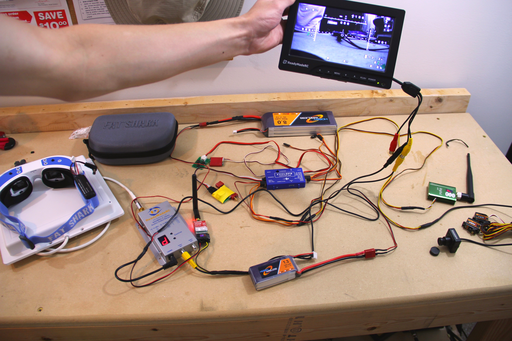

# drone-business
 A picture book story of how I found a niche in the world of radio controlled aircraft
 and ended up creating my own online gig at 13 years old custom building and selling unmanned aircraft 
 electronic systems.
 
### Contents
[Foundations](#the-beginning-science-fair-2011)  
[Research](#research-2012)   
[First few years](#business-2013---2014)   
[My finest work](#my-finest-work-2015---2016)   
[Personal UAS Setups](#my-personal-setups)

# The Beginning: Science Fair 2011

I convinced my parents I needed an RC jet for a science fair project on UAVs as a display item during 
the presentation of this project at my middle school's science fair.  And so it happened, that I had a 
SkyFun jet from HobbyKing and a cheapo 72mhz radio control.  I promptly tried to fly it and crashed, even 
before the science fair itself.  I repaired it and still displayed it on the table with my giant poster board 
above.  Later on in life, I used this poster board to create a shipping box large enough for a RMRC Penguin 
aircraft frame after I was done flying it and had moved on to other projects.

# Research: 2012
I obviously had no money at 13 years old to buy any drone technology, but I basically researched as much as I could. 
This was during the time of YouTubers like Team Blacksheep (Raphael Pirker), muni86, and Crashz9, who were all pioneers of 
the world of FPV (First Person View) radio control piloting.  Raphael was of course, popular for his flight over New 
York City, which blew up the RC internet for some time about the dangers associated with FPV flying.

FPV in 2012 was hacking, soldering, and custom wiring looms everywhere.  There was no DJI Phantom to fly, and 
very little (read: zero) ready-to-fly FPV aircraft.  As I read RCGroups and FPVLab on a daily basis, I started to 
realize that there was a significant market for this sort of electronics setup service in the FPV hobby.  If you knew 
what parts to buy and how to wire the stuff, it was a breeze.  But with many folks still getting used to touch screen 
phones, this was a significant challenge.

A thus, the idea was born: I can learn how to set these wireless video link systems up for RC aircraft and sell them!

# Business: 2013 - 2014
I made a couple hundred dollars my first few years, but this was basically like being a millionaire for 
my age.  Here are some of the setups that I was building - simple, clean systems with cameras, 
transmitter/receiver combinations, antennas and video monitors, all with the right battery plugs, filters, and adapters to 
make it ready to go for the customer.  I even had a few OSD setups in there (On Screen Display of flight 
and aircraft characteristics).

### Popular Monitor Setup Example
- 1.3 GHz Video Transmitter & Receiver
- Notch Filter on vTX to decrease UHF interference
- Deans "tap" adapter for 3S LiPo main aircraft battery power to video system
- Filtering on power input side too on vTX to eliminate lines in vide
- Phillips 9'' monitor
- GoPro plug on vTX for live video feed straight from recording camera

This is a classic system which I built on many different video frequencies for either GoPro live feeds, 
or a stand alone FPV (normally a small 1/3'' CCD security type) camera.  These were popular systems due 
to simplicity: just plug the tap adapter between the ESC & battery of your aircraft, mount the vTX, 
and hook up a 3S to the RX with the monitor on a tripod, and you are ready to go.

### Longer Range 2.4 GHz Example
- 2.4 GHz LawMate Transmitter & Receiver
- 2.4 GHz Patch Antenna (13dbi) (this was a longer range system)
- ImmersionRC EzOSD (On Screen Display - see monitor pic for it in action)
- Voltage regulator (12v to 5v) from amp sensor on EzOSD for LawMate vTX
- RMRC 700TVL FPV Camera (12v)   

This system was tricky because of the LawMate running 5v and camera on 12v.  The EzOSD was a breeze to set up
though, and some of the features it has far outweighed the price back 1/2 a decade - speed, distance, altitude,
direction to fly back to yourself, and of course power details and other features.

### Custom Wiring Looms ready for specific aircraft setups
- Cyclops NOVA Custom OSD wiring
- Deans current sensor, wired ready for camera, TX, and RC control RX output for RTH (Return to Home) 
functionality

I had a few requests simply to make integration of a certain electronic part plug-and-play for the user.  
This one below was an OSD designed to also connect in-line with the servos of the aircraft so that it could be
programmed to fly back towards home, for example, in the even of a radio link failure.

# My Finest Work: 2015 - 2016
In these years I really fine-tuned my art, for customers and personal use alike, before leaving this amazing 
hobby of mine to fly down to university, with the intention of studying UAS at Embry-Riddle Aeronautical 
University.

#### Encased Repeater Ground Station type setups
- 1.3 GHz Transmitter/Receiver (with ComTech tuner)
- 1.3 GHz Patch antenna in case top, linear whip antenna on vTX
- CYCLOPS On Screen Display
- Headtracking pan and tilt setup with accelerometers in goggles and 2 servos on camera mount
- 5.8 GHz ImmersionRC vTX in the case (top of 1.3 RX) to repeat signal for goggles
- RMRC 700TVL FPV Camera
- FatShark Dominator Goggles w/built-in 5.8 GHz module (WIRELESS long range due to repeater!)
- Backup/spectator 7'' monitor
- 3S LiPos, note independence from UAS power system (no risk of interference from ESC, best for high voltage UAS)
- Also made a custom wiring schematic for this one due to complexity
- DragonLink UHF system for aircraft control also set up - not pictured - ready for head tracking 

Here is a pic before encasing the system:

#### Diversity Repeater System with Recording DVR of Live Feed
- DUAL 1.3 GHz Video Receivers
- Stock whip antenna on one, Video Aerial Systems antenna on the other
- All mounted on back of VAS antenna
- Eagle Eyes diversity system 
- DVR also wired in to record live feed from aircraft
- 25mw 5.8 GHz vTX to repeat signal to video glasses

# My Personal Setups

