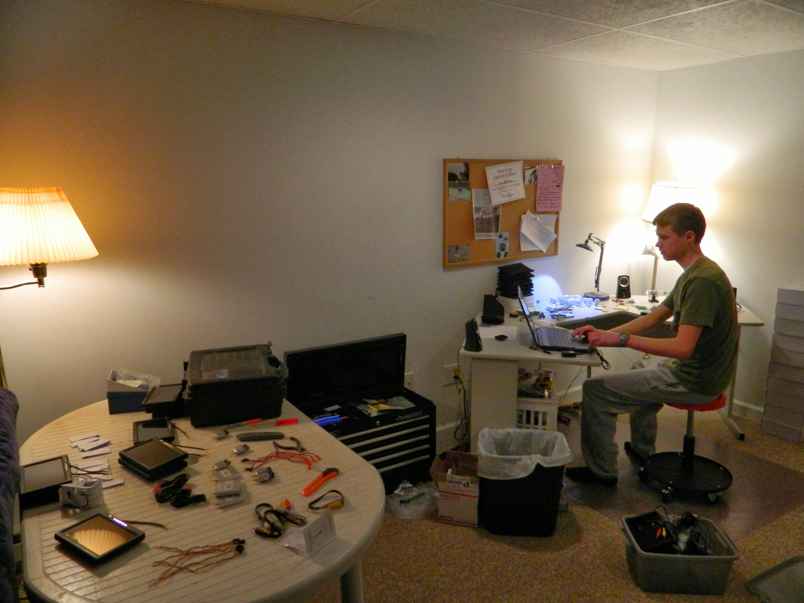

# drone-business
 A picture book story of how I found a niche in the world of radio controlled aircraft
 and ended up creating my own online gig at 13 years old custom building and selling drones.

# The Beginning: Science Fair 2011

I convinced my parents I needed an RC jet for a science fair project on UAVs as a display item during 
the presentation of this project at my middle school's science fair.

# Research Insanity: 2012

# Business: 2013 - 2014

# My Finest Work: 2015 - 2016

# My Personal Setups

